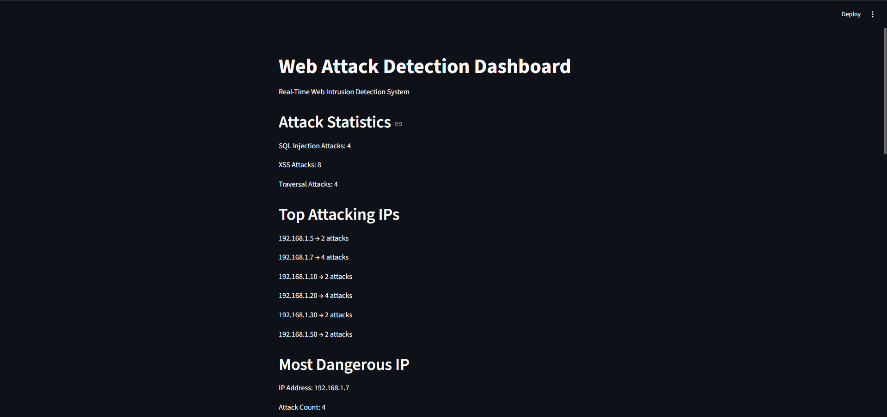
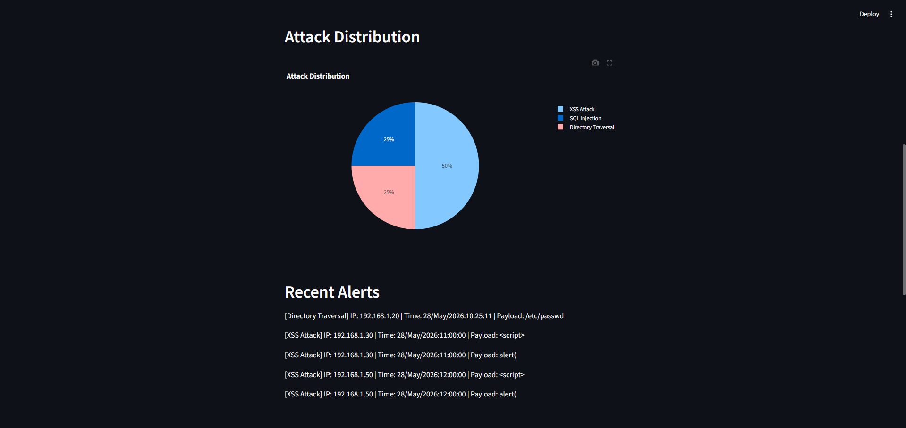
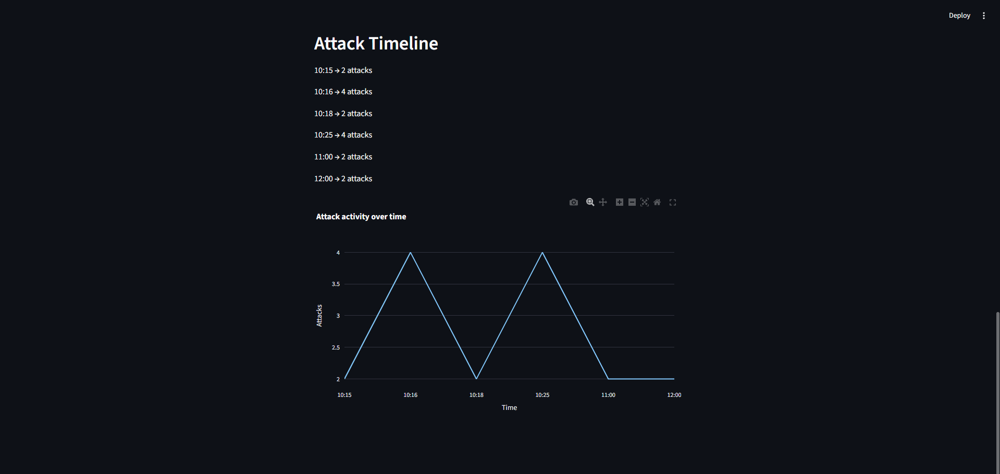

# Real-Time Web Intrusion Detection and Monitoring System

## Overview

This project is a Python-based Web Intrusion Detection System (IDS) that monitors web server logs, detects common web attacks, generates alerts, and visualizes security events through a real-time dashboard.

The system is designed for learning cybersecurity, log analysis, attack detection, and security monitoring concepts.

---

## Features

### Attack Detection

* SQL Injection Detection
* Cross-Site Scripting (XSS) Detection
* Directory Traversal Detection

### Monitoring

* Offline Log Analysis
* Real-Time Log Monitoring
* Alert Generation
* Alert Logging

### Dashboard

* Attack Statistics
* Top Attacker IPs
* Most Dangerous Attacker
* Attack Distribution Pie Chart
* Attack Timeline Chart
* Recent Alerts Panel
* Auto Refresh

---

## Project Structure

web-attack-detector/

├── detector.py

├── realtime_detector.py

├── dashboard.py

├── alerts.log

├── README.md

└── logs/

```
└── access.log
```

---

## Technologies Used

* Python
* Streamlit
* Plotly
* Watchdog (initial implementation)
* Log Analysis Techniques

---

## How to Run

### Install Dependencies

pip install streamlit plotly numpy pandas

### Run Real-Time Monitoring

python realtime_detector.py

### Launch Dashboard

streamlit run dashboard.py

---

## Example Detected Attacks

### SQL Injection

OR 1=1

UNION SELECT

'--

### XSS

<script>

alert(

onerror=

### Directory Traversal

../

/etc/passwd

---

## Future Improvements

- Brute Force Detection
- Geolocation Tracking
- Email Alerts
- Threat Intelligence Integration
- Machine Learning-Based Anomaly Detection

---

## Learning Outcomes

Through this project I learned:

- Python Programming
- Log Parsing
- Real-Time Monitoring
- Security Analytics
- Streamlit Dashboard Development
- Intrusion Detection Concepts
- Cybersecurity Monitoring Workflows


# Real-Time Web Intrusion Detection System

## Dashboard Preview

### Main Dashboard



---

### Attack Distribution



---

### Attack Timeline

